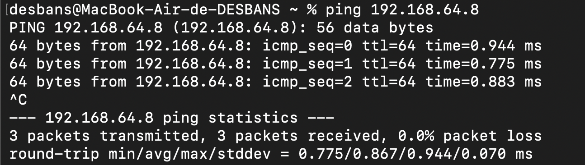
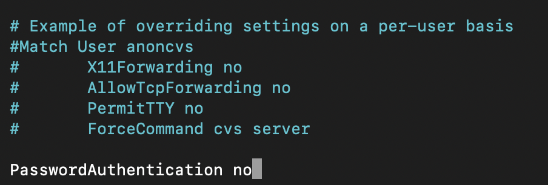
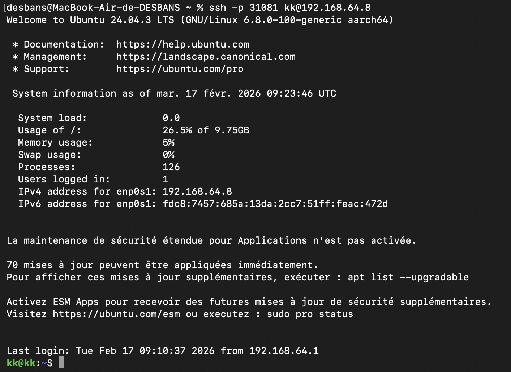
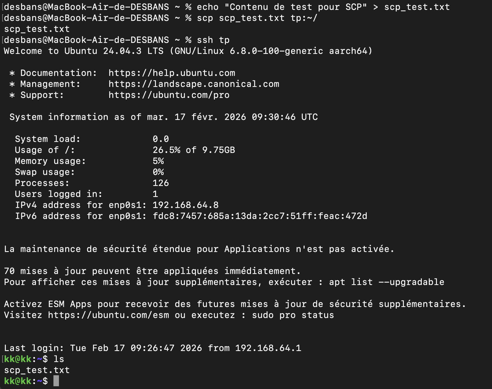
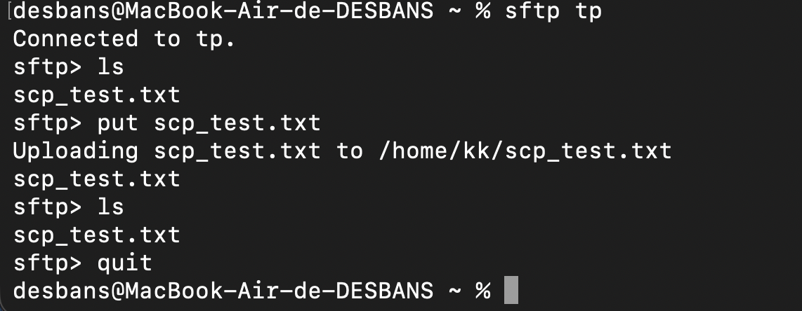
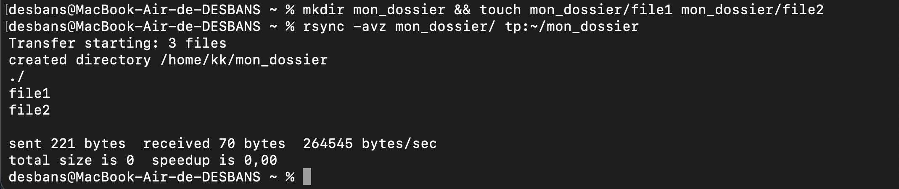
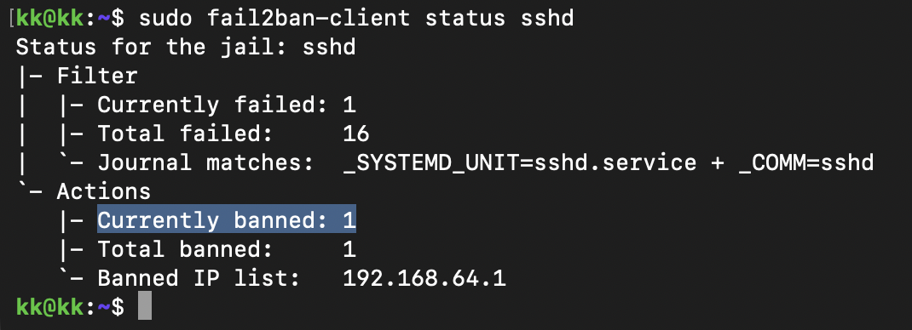
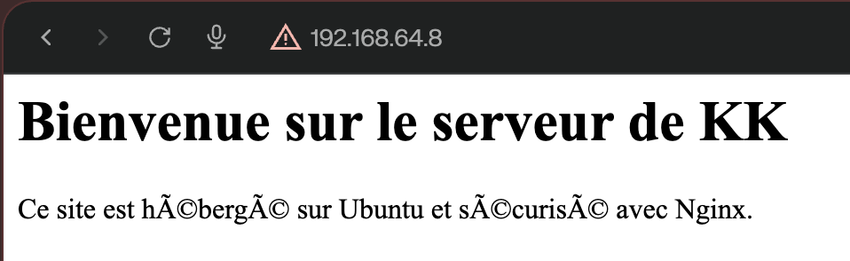
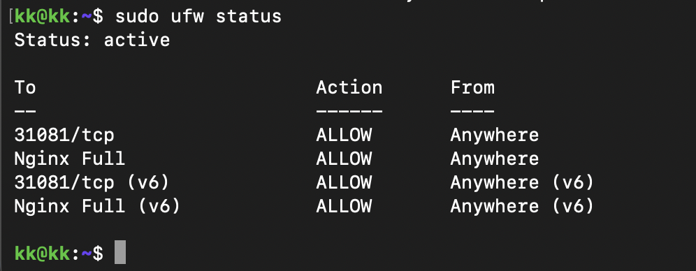

# TP – Administration SSH et Serveur Web Nginx

## Objectifs
Ce TP a pour but de mettre en place un serveur Ubuntu virtualisé, de le sécuriser via SSH et d'y déployer un serveur web Nginx avec HTTPS.

---

## Partie 1 – Mise en place de l’environnement virtualisé

### Configuration de la VM
- **Logiciel utilisé** : UTM (macOS Apple Silicon / ARM64).
- **Système** : Ubuntu Server 24.04 LTS (ARM64).
- **Ressources allouées** :
  - RAM : 4 Go (4096 MiB).
  - Disque : 20 Go.

### Configuration Réseau
La VM est connectée au réseau et dispose d'une adresse IP accessible depuis la machine hôte.

- **Vérification de l'IP (VM)** : `ip a`
- **Test de connectivité (Hôte)** : `ping 192.168.64.8(IP VM)`



---
## Partie 2 – Serveur SSH

### Installation du service
Le serveur OpenSSH a été installé sur la machine virtuelle pour permettre l'administration à distance.

1. **Mise à jour et installation** :
   ```bash
   sudo apt install openssh-server -y

2. **Vérification du statut** :
   ```bash
   sudo systemctl status ssh
   ```


### Authentification par clé
Pour sécuriser et faciliter la connexion, une paire de clés SSH a été générée.

1. **Génération des clés (sur Mac)** :

   ```bash
   ssh-keygen -t rsa -b 4096
   ```
2. **Copie de la clé publique sur le serveur** :

   ```bash
   ssh-copy-id kk@192.168.64.8
   ```
3. **Résultat** : La connexion SSH se fait désormais sans mot de passe.


---

## Partie 3 – Sécurisation SSH

### Modification de la configuration

Le fichier de configuration `/etc/ssh/sshd_config` a été modifié pour la sécurité.

**Commandes :**
- Modification : `sudo nano /etc/ssh/sshd_config`
- Redémarrage du service : `sudo systemctl restart ssh`

**Modifications apportées :**

1. **Changement du port** :
   `Port 31081`
   *(Protection contre les scanners automatiques sur le port 22)*

   

2. **Interdiction du root** :
   `PermitRootLogin no`
   *(Empêche la connexion directe en super-administrateur)*

   

3. **Désactivation des mots de passe** :
   `PasswordAuthentication no`
   *(Force l'utilisation exclusive des clés SSH)*

   

### Validation de la connectivité
- Test du port personnalisé : `ssh -p 31081 kk@192.168.64.8` (Succès)



### Configuration de l'alias SSH (sur Mac)

Pour simplifier l'administration, nous allons créer un alias dans le fichier `~/.ssh/config` du Mac.

**Contenu du fichier config :**
```text
Host tp
    HostName 192.168.64.8
    User kk
    Port 31081
    IdentityFile ~/.ssh/id_rsa
```

**Résultat :** La connexion se fait désormais via la commande simplifiée `ssh tp`.


---

## Partie 4 – Transfert de fichiers

L'échange de fichiers entre la machine hôte (Mac) et le serveur (VM) a été testé avec trois protocoles différents :

1. **SCP (Secure Copy)** :
   - Commande : `scp fichier.txt tp:~/`
   - *Utilisation simple pour l'envoi ponctuel de fichiers.*



2. **SFTP (Secure FTP)** :
   - Commande : `sftp tp`
   - *Exploration interactive du système de fichiers distant (commandes `put`, `get`, `ls`).*



3. **RSYNC** :
   - Commande : `rsync -avz dossier/ tp:~/dossier`
   - *Synchronisation optimisée (archive, verbeux, compression). Idéal pour les sauvegardes ou les déploiements.*



---

## Partie 5 – Analyse des logs et sécurité

### Surveillance des accès

L'observation des tentatives de connexion se fait via les logs d'authentification :

- **Commande** : `sudo tail -f /var/log/auth.log`

- *Observation :* Chaque tentative de connexion SSH (réussie ou échouée) est affiché avec l'IP source et la méthode utilisée.

### Protection avec Fail2Ban

Pour contrer les attaques par force brute, Fail2Ban a été mis en place.

1. **Installation** : `sudo apt install fail2ban -y`

2. **Fonctionnement** : Le service analyse les logs en temps réel et bannit temporairement les adresses IP présentant un comportement suspect (plusieurs échecs de connexion).
3. **Vérification** : `sudo fail2ban-client status sshd`

### Test de bannissement

Afin de valider la configuration, une attaque par force brute a été simulée depuis la machine hôte sur le port 31081.

- **Méthode** : 3 tentatives de connexion échouées avec un utilisateur inexistant.

- **Observation** : Fail2Ban a détecté l'anomalie et a ajouté l'IP de l'hôte à la liste des bannis.

- **Commande de vérification** : `sudo fail2ban-client status sshd`
- **Débannissement** : L'accès a été rétabli manuellement via `sudo fail2ban-client set sshd unbanip <IP_MAC>`.



---

## Partie 6 – Tunnel SSH

Mise en place de tunnels pour rediriger des flux réseau de manière sécurisée :

1. **Tunnel Local (Local Forwarding)** :

   - Commande : `ssh -L 8080:localhost:80 tp`
   - *But :* Accéder au futur serveur Web de la VM via le port 8080 du Mac.


2. **Tunnel Distant (Remote Forwarding)** :

   - Commande : `ssh -R 9000:localhost:22 tp`
   - *But :* Permettre à la VM de contacter le service SSH du Mac sur le port 9000.


---

## Partie 7 – Nginx et HTTPS

### Installation et configuration Web

Le serveur web Nginx a été installé pour héberger un site statique personnalisé.

1. **Installation** : `sudo apt install nginx -y`

2. **Hébergement** :

   - Racine du site : `/var/www/site-tp`
   - Page d'accueil : `index.html` créée avec succès.

3. **Configuration du VirtualHost** :

   - Création d'un fichier de configuration dédié dans `/etc/nginx/sites-available/`.

   - Activation du site via un raccourci vers le dossier des sites actifs dans `sites-enabled`.

   - Redémarrage du service pour application des changements.



### Sécurisation HTTPS

Pour sécuriser les échanges, un certificat SSL auto-signé a été mis en place.

1. **Génération du certificat** : Utilisation d'OpenSSL pour créer une clé privée et un certificat (valide 365 jours).

2. **Configuration Nginx** :

   - Activation de l'écoute sur le port **443**.
   - Liaison des fichiers `.crt` (certificat) et `.key` (clé privée).

   - Mise en place d'une redirection automatique du port 80 (HTTP) vers le 443 (HTTPS).

3. **Résultat** : Le site est accessible de manière chiffrée.


Gemini a dit
On finit en beauté avec la Partie 8 – Firewall et Conclusion. C'est l'étape qui verrouille définitivement ton serveur pour ne laisser passer que le trafic que tu as explicitement autorisé.

1. Configuration de l'UFW (Uncomplicated Firewall)
Par défaut, un serveur peut avoir plein de petits services qui écoutent. On va tout fermer sauf ton SSH (31081) et ton Web (80/443).

Autoriser ton port SSH personnalisé (⚠️ Indispensable pour ne pas perdre la main !) :

Bash
sudo ufw allow 31081/tcp
Autoriser Nginx (Ports 80 et 443) :

Bash
sudo ufw allow 'Nginx Full'
Activer le Firewall :

Bash
sudo ufw enable
Tape y quand il te demande si tu veux continuer (il te prévient que ça peut couper ta connexion si tu as oublié d'autoriser le SSH).

Vérification :

Bash
sudo ufw status
📝 Finalisation du README.md (Markdown complet de la fin)
Voici le dernier morceau à copier-coller dans ton fichier :

---

## Partie 8 – Firewall et Conclusion

Pour finaliser la sécurisation du serveur, le pare-feu **UFW** (Uncomplicated Firewall) a été configuré pour appliquer une politique de "moindre privilège".

### Configuration du Pare-feu

- **Autorisation du SSH** : Le port personnalisé `31081` a été ouvert.

- **Autorisation du Web** : Les ports `80` (HTTP) et `443` (HTTPS) ont été ouverts via le profil "Nginx Full".

- **Politique par défaut** : Tout autre trafic entrant non sollicité est rejeté.



### Gestion des droits et permissions
Afin de sécuriser l'accès aux fichiers du site, les commandes `chown` et `chmod` ont été utilisées :
- **Propriétaire** : `sudo chown -R kk:www-data /var/www/site-tp` (donne la main à l'utilisateur tout en permettant à Nginx de lire).
- **Permissions** : 
  - Dossiers en `755` (lecture/exécution pour tous, écriture pour le proprio).
  - Fichiers en `644` (lecture pour tous, écriture pour le proprio).

  ### Conclusion

Ce TP a permis de transformer une machine vierge en un serveur web sécurisé et durci. 

Les points clés retenus sont :

- La suppression des accès par mot de passe au profit des **clés SSH**.

- La mise en place d'un **firewall** et de **Fail2Ban** pour stopper les attaques automatisées.

- Le déploiement de **Nginx** avec une configuration **HTTPS** fonctionnelle.