# Compte-rendu TP 5 : pfSense – Bases d’un pare-feu

## Objectifs du TP

* Mise en place d'un laboratoire avec plusieurs VMs sous UTM.

* Installation et configuration complète du pare-feu pfSense.

* Sécurisation de l'administration et compréhension de la logique réseau (WAN/LAN).

---

## Partie 1 – Prise en main et sécurisation

### 1. Accès à l’interface

Après configuration, j'ai accédé à l'interface Web via le navigateur de mon Mac.

* **Quelle est l’adresse IP du LAN ?** : L'adresse IP du LAN est `192.168.128.2`.

* **Quelle est l’adresse IP du WAN ?** : L'adresse IP du WAN est `192.168.64.9`.

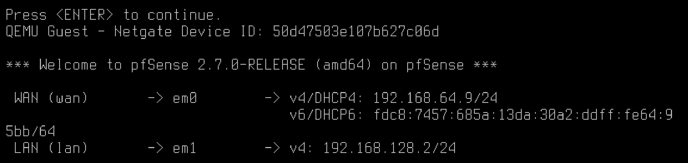

* **Pourquoi utilise-t-on HTTPS ?** :

 On utilise HTTPS pour chiffrer la session d'administration entre le poste client et le pare-feu. Cela empêche qu'un attaquant sur le réseau puisse intercepter le mot de passe ou les réglages en "clair".

* **Pourquoi faut-il changer les identifiants par défaut sur un pare-feu ?** :

 Les identifiants par défaut (`admin / pfsense`) sont publics et connus de tous. Ne pas les changer permettrait à n'importe qui sur le réseau de prendre le contrôle total de la sécurité et de l'infrastructure.

### 2. Sécurisation de l’accès administrateur

J'ai procédé à la mise à jour des paramètres du compte admin.

* **Où se gèrent les utilisateurs ?** :

Les utilisateurs se gèrent dans le menu **System > User Manager**.

* **Qu’est-ce qu’un mot de passe robuste ?** :

 Un mot de passe robuste est un mot de passe long (au moins 12 caractères) qui mélange des majuscules, des minuscules, des chiffres et des caractères spéciaux, tout en étant imprévisible.

* **Pourquoi sécuriser en priorité l’accès admin sur un équipement réseau ?** : 

Car l'accès admin est le point le plus critique de l'infrastructure. S'il est compromis, un attaquant peut désactiver le filtrage, rediriger le trafic vers des sites malveillants ou créer des portes dérobées (backdoors) sur tout le réseau.

---

## Partie 2 – Comprendre les interfaces réseau

### 3. Vérification des interfaces

J'ai vérifié la correspondance des interfaces physiques (`em0`, `em1`).

* **Quelle interface permet l’accès Internet ?** : 

C'est l'interface **WAN** (liée à la carte `em0`), qui reçoit son adresse IP du réseau externe.

* **Quelle interface correspond au réseau interne ?** :

 C'est l'interface **LAN** (liée à la carte `em1`), qui sert de passerelle pour la VM Ubuntu.

* **Que se passerait-il si les interfaces étaient inversées ?** : 

    1. **Perte de connexion** :

     Le pare-feu ne pourrait plus router les paquets vers Internet car il chercherait la connexion sur le mauvais câble physique.

    2. **Blocage de l'administration** : 
    
    Par défaut, pfSense bloque tout accès entrant sur le WAN. Si l'interface reliée à mon Mac était vue comme le WAN, je serais immédiatement déconnecté de l'interface web.

    3. **Faille de sécurité** : 
    
    Le réseau interne serait exposé sans protection vers l'extérieur, tandis que le pare-feu tenterait de filtrer un trafic Internet déjà "dedans".

 ---

## Partie 3 – Configuration des services réseau

### 4. DHCP (Dynamic Host Configuration Protocol)

Le serveur DHCP a été activé sur l'interface LAN pour automatiser la configuration réseau des clients.

* **Pourquoi utiliser DHCP plutôt qu’une IP fixe ?** : 

Le DHCP permet une gestion centralisée et automatique des adresses IP. Cela évite les erreurs de saisie manuelle, les conflits d'adresses (deux machines avec la même IP) et facilite l'ajout de nouveaux équipements sans intervention technique sur chaque poste.

* **Quelle plage d’adresses choisir ?** : 

La plage doit être comprise dans le sous-réseau du LAN. Par exemple, si le LAN est `192.168.128.2`, on peut choisir une plage allant de `192.168.128.100` à `192.168.128.200`.


* **Quelles adresses faut-il éviter d’inclure dans la plage ?** : 

Il faut exclure l'adresse de la passerelle elle-même (`192.168.128.2`), l'adresse de broadcast (généralement `.255`), ainsi que les adresses réservées aux équipements qui nécessitent une IP fixe.

* **Vérification (Ubuntu)** :

 Une fois le serveur activé, la commande `ip a` sur Ubuntu confirme que la machine obtient automatiquement une adresse IP dans la plage définie.

 

### 5. DNS (Domain Name System)

Le service **DNS Resolver (Unbound)** a été activé pour permettre la résolution de noms.

* **Pourquoi un pare-feu peut-il jouer le rôle de serveur DNS ?** :

 En jouant le rôle de serveur DNS, le pare-feu peut mettre en cache les requêtes pour accélérer la navigation. Surtout, cela lui permet de filtrer ou de bloquer l'accès à certains sites en refusant de résoudre leur nom de domaine (ex: bloquer `facebook.com`).

* **Que se passe-t-il si le DNS ne fonctionne pas mais que le ping vers 8.8.8.8 fonctionne ?** : 

Dans ce cas, la connexion Internet est active (le trafic IP passe), mais il est impossible de naviguer sur le Web en tapant des noms de domaine (comme `google.fr`). On peut joindre un serveur par son "numéro" (IP), mais pas par son "nom".

* **Vérification (test ping google.com)** :

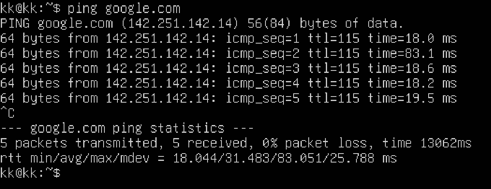

---

## Partie 4 – Autoriser l’accès Internet

### 6. Règles de pare-feu

Pour permettre à la VM Ubuntu d'accéder au Web, j'ai configuré une règle d'autorisation dans le menu **Firewall > Rules > LAN**.

**Questions :**

* **Quelle doit être la source ?** : La source doit être **LAN net**. Cela représente l'ensemble du réseau local privé rattaché à l'interface LAN (ici le réseau `192.168.128.0/24`).

* **Quelle doit être la destination ?** :

 La destination doit être **any** (n'importe laquelle). Pour accéder à Internet, on ne peut pas limiter la destination à une IP précise car les serveurs web sont répartis partout dans le monde.

* **Faut-il autoriser tous les protocoles ?** : Oui, dans cette phase de test, nous autorisons le protocole **Any** (TCP, UDP, ICMP, etc.). Cela permet de valider que la communication de base fonctionne avant de mettre en place un filtrage plus restrictif.

### Tests de connectivité effectués

Une fois la règle appliquée, j'ai validé la connexion depuis le terminal Ubuntu :

* **Ping vers pfSense** : 

Succès. La communication avec la passerelle `192.168.128.2` est établie.

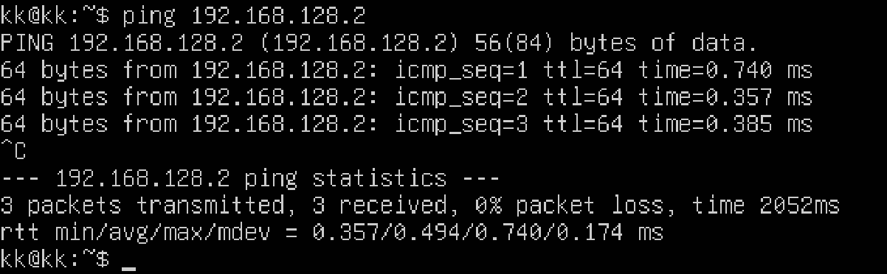

* **Ping vers 8.8.8.8** :

 Succès. Le trafic ICMP sort bien sur Internet et le NAT est fonctionnel.


* **Test DNS** : Succès. La résolution de noms fonctionne, permettant de traduire `google.com` en adresse IP.

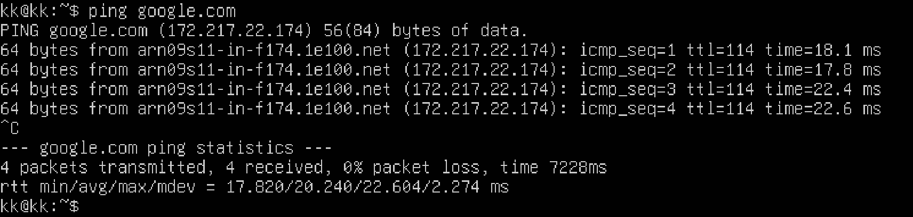

* **Accès web** : Succès. Le trafic applicatif traverse correctement le pare-feu.

### Dépannage (Troubleshooting)

Si l'accès ne fonctionne pas, il faut inspecter les points suivants :

1. **Les Logs (Status > System Logs > Firewall)** : 

Permet de voir en temps réel si pfSense rejette des paquets (affichés en rouge avec une icône de blocage).

2. **Le NAT (Firewall > NAT > Outbound)** : Indispensable pour que les adresses privées du LAN soient traduites en adresse publique WAN afin de naviguer sur Internet.

3. **L'ordre des règles** : pfSense applique les règles de **haut en bas**

### 7. NAT (Network Address Translation)

Le NAT est le mécanisme qui permet aux adresses privées de mon réseau LAN d'être traduites en une adresse publique (ou l'adresse WAN du pare-feu) pour naviguer sur Internet.

**Questions :**

* **Pourquoi le NAT est-il nécessaire avec une interface WAN en NAT ?** :

 Même si l'interface WAN reçoit déjà une IP via UTM, le NAT de pfSense est indispensable car le réseau LAN (`192.168.128.x`) est un réseau privé "non routable" sur Internet. Sans le NAT de pfSense, les serveurs distants recevraient des paquets d'une IP privée et ne sauraient pas où renvoyer la réponse. On a ici un phénomène de "Double NAT" (celui de pfSense et celui d'UTM).

* **Quelle est la différence entre NAT automatique et manuel ?** : 

    * **NAT Automatique** : 
    
    pfSense crée lui-même les règles de traduction pour chaque nouveau réseau ajouté sur les interfaces internes. C'est la solution la plus simple pour un usage standard.
    * **NAT Manuel** : 
    
    L'administrateur doit créer chaque règle à la main. Cela permet un contrôle total (choisir quelle IP sort par quelle interface), mais c'est plus complexe et risque de bloquer tout accès en cas d'oubli.

* **Comment vérifier qu’une traduction d’adresse a lieu ?** : 

    1. **Dans pfSense** : 
    
    En allant dans **Diagnostics > States**, on peut voir la table des connexions actives montrant l'IP source interne traduite vers l'IP du WAN.

  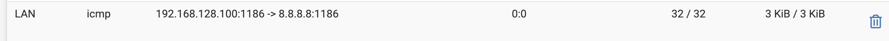

    2. **Via les logs** : 
    
    Dans **Status > System Logs > Firewall**, on peut observer le trafic sortant.

  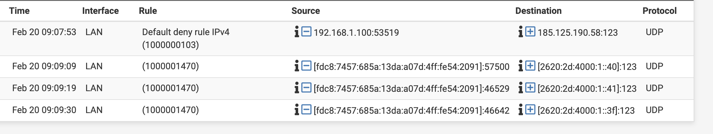

    3. **Test externe** :
    
     Sur la machine Ubuntu, en utilisant une commande comme `curl ifconfig.me`, on verra s'afficher l'IP du WAN de pfSense et non l'IP privée de la VM.


## Partie 5 – Filtrage

### 8. Blocage d’un site spécifique

### Objectif

Bloquer l’accès à un site web de votre choix, puis tester et observer les logs.

### Mise en place (pfSense)

- Choisir un site (ex: youtube.com).

- Identifier sa/ ses IP(s) depuis Ubuntu (ex: `nslookup youtube.com` ou `dig youtube.com`).

- Dans pfSense : **Firewall → Rules → LAN → Add (↑)**.

- Créer une règle **Block** sur l’interface **LAN** :

  - Source = `LAN net`

  - Destination = `Single host or alias` (mettre l’IP trouvée)

  - Protocol = `TCP/UDP` (ou TCP si vous ne voulez bloquer que le web)

  - Ports destination = `80` et `443`

- Cocher l’option de log sur la règle, enregistrer puis **Apply Changes**.

### Tests & logs

- Depuis Ubuntu : tester l’accès `curl -I https://youtube.com`.

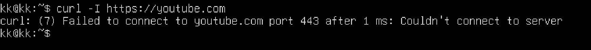

- Dans pfSense : vérifier les entrées dans **Status → System Logs → Firewall** (paquets bloqués correspondant à la règle).

### Questions : 

- Faut-il bloquer par IP ou par nom de domaine ?  
Le filtrage firewall classique se fait surtout par **IP**, mais c’est fragile si les IP changent (CDN) ; le blocage par **nom de domaine** se fait plutôt via DNS (plus pratique mais dépend du DNS utilisé).

- Que se passe-t-il si le site utilise HTTPS ?  
On ne “voit” pas l’URL dans le firewall : si tu bloques l’IP/port 443, la connexion HTTPS échoue (timeout/refus), sans message HTTP lisible.

- Pourquoi le blocage par IP peut-il être contourné ?  
Parce qu’un site peut avoir plusieurs IP (load-balancing/CDN) et elles peuvent changer ; l’utilisateur peut aussi passer par un VPN/proxy ou un DNS différent selon le cas.

### 9. Blocage d’une catégorie de sites (jeux d’argent)

### Objectif

Créer une solution propre et maintenable pour bloquer plusieurs sites (utilisation d’alias), puis tester et analyser les logs.

### Mise en place (pfSense)

- Créer un alias contenant la liste des sites à bloquer :
  - Aller dans **Firewall → Aliases**
  - **Add**
  - Name : `jeux_argent`
  - Type : `Host(s)` (ou FQDN/Hosts selon ton pfSense)
  - Ajouter plusieurs domaines (ex: `winamax.fr`, `betclic.fr`, `pmu.fr`, `unibet.fr`)
  - **Save → Apply Changes**

- Créer une règle de blocage basée sur l’alias :
  - Aller dans **Firewall → Rules → LAN**
  - **Add (↑)** (placer la règle au-dessus d’une règle “Pass” générale)
  - Action : **Block**
  - Source : `LAN net`
  - Destination : `Single host or alias` → saisir `jeux_argent`
  - (Optionnel) Destination Port : `80` et `443` si blocage web uniquement
  - Activer **Log**
  - **Save → Apply Changes**

### Tests & logs

- Depuis Ubuntu : tester l’accès à un des sites (navigateur) ou via :
  - `curl -I https://winamax.fr`
- Dans pfSense : vérifier dans **Status → System Logs → Firewall** que la règle bloque bien le trafic.

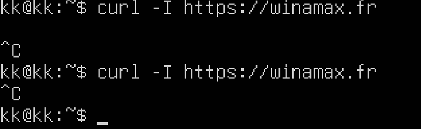


### Questions (réponses)

- Pourquoi ne pas créer une règle par site ?  
Parce que ce n’est pas maintenable : trop de règles à gérer. Un alias permet de centraliser la liste et de garder une seule règle.

- Où se créent les alias ?  
Dans **Firewall → Aliases**.

- Comment vérifier qu’une règle bloque réellement le trafic ?  
En activant le logging sur la règle et en consultant **Status → System Logs → Firewall** (et/ou via **Diagnostics → Packet Capture** si besoin).


## Partie 6 – Aller plus loin (partie plus tendue)

### 10. Blocage par catégorie (réseaux sociaux)

### Objectif
Créer un alias pour la catégorie "réseaux sociaux", implémenter une règle de blocage et analyser les logs.

#### Étape 1 – Créer l'alias

- Aller dans **Firewall → Aliases → Add**
- Name : `reseaux_sociaux`
- Type : `Host(s)`
- Hosts : `facebook.com`, `www.facebook.com`, `instagram.com`, `www.instagram.com`, `tiktok.com`, `www.tiktok.com`, `snapchat.com`, `x.com`

- **Save → Apply Changes**

#### Étape 2 – Implémenter la règle

- Aller dans **Firewall → Rules → LAN → Add (↑)**
- Action : **Block**
- Interface : LAN
- Protocol : TCP/UDP
- Source : `LAN net`
- Destination : `Single host or alias` → `reseaux_sociaux`
- Log : activé
- Description : `Block reseaux sociaux`
- **Save → Apply Changes**

#### Étape 3 – Analyser les logs

- Depuis Ubuntu : `curl -I https://instagram.com` 


- Dans pfSense : **Status → System Logs → Firewall** → vérifier les paquets bloqués

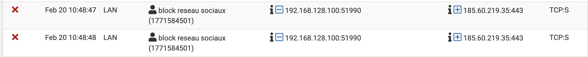

#### Question (réponse)

- Que se passe-t-il si la règle est placée sous une règle "Pass Any" ?  
La règle de blocage est ignorée. pfSense lit les règles de haut en bas et s'arrête à la première qui correspond : si "Pass Any" est au-dessus, tout le trafic est autorisé avant même d'atteindre la règle Block. Il faut toujours placer les règles Block **au-dessus** des règles Pass générales.

### 11. Règles horaires

#### Objectif

Créer une plage horaire (schedule) dans pfSense et l'appliquer à une règle de pare-feu pour qu'elle ne s'active qu'à certains moments.

#### Étape 1 – Créer un horaire (Schedule)

- Aller dans **Firewall → Schedules → Add**.

- **Schedule Name** : `Heures_Bureau` (sans espaces ni caractères spéciaux).

- **Description** : Heures de travail en semaine.

- **Month / Days** : Sélectionner les jours de la semaine (ex: Lundi au Vendredi) en cliquant sur les jours dans le calendrier.

- **Time** : Saisir la plage horaire, par exemple de `08:00` à `18:00`.

- Cliquer sur le bouton **Add Time** pour valider et ajouter cette plage horaire au bloc.
- **Save**.


#### Étape 2 – Appliquer l'horaire à une règle existante

- Aller dans **Firewall → Rules → LAN**.

- Modifier  une règle existante, par exemple la règle de blocage des réseaux sociaux.

- Descendre tout en bas de la page et cliquer sur le bouton **Display Advanced** (Afficher les options avancées).

- Chercher la ligne **Schedule** et sélectionner l'horaire `Heures_Bureau` dans le menu déroulant.
- **Save → Apply Changes**.


#### Questions (réponses)

- **Pourquoi les règles horaires sont-elles utiles en entreprise ?**  

  Elles répondent à trois besoins principaux :

  1. **Productivité** :
  
   Bloquer les réseaux sociaux ou le streaming pendant les heures de travail, mais les autoriser pendant la pause déjeuner (12h-14h) ou le soir.

  2. **Sécurité (réduction de la surface d'attaque)** :
  
   Désactiver certains accès externes (comme un VPN ou un accès RDP/SSH) la nuit et le week-end quand aucun employé n'est censé travailler.

  3. **Gestion de la bande passante** :
  
   Autoriser les flux réseau très lourds (comme les grosses sauvegardes ou les mises à jour serveurs) uniquement la nuit pour ne pas saturer la connexion la journée.

### 12. Serveur web local

### Objectifs

Installer un serveur web sur une VM Ubuntu (LAN) et configurer le pare-feu pfSense pour autoriser l'accès à une adresse IP spécifique tout en bloquant les autres.

### Mise en place (Ubuntu)

1. **Installer Apache** sur la VM Ubuntu en tapant ces commandes :

```
    sudo apt update
    sudo apt install apache2 -y
    sudo systemctl enable apache2
    sudo systemctl start apache2
````

2. **l'IP** de la VM Ubuntu : `192.168.1.100`

test sur safari : 
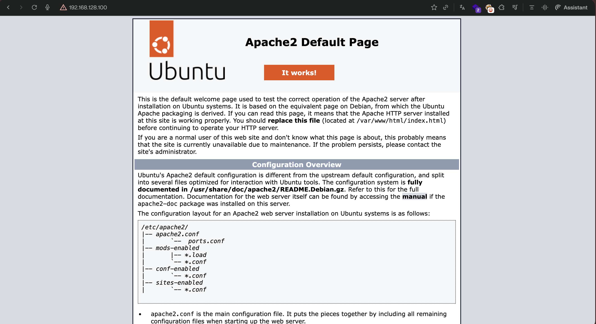

### Mise en place (pfSense)

*Pour que pfSense puisse filtrer le trafic, la machine source doit se trouver sur un autre réseau (ex: le WAN ou une DMZ). Si les deux machines sont sur le même sous-réseau LAN, le trafic passe directement par le switch (ARP) et le pare-feu n'est jamais interrogé.*

Dans **Firewall → Rules → LAN** 

1. **Règle d'autorisation (Autoriser une IP spécifique)** :
   - **Action** : Pass (↑ la placer au-dessus de la règle de blocage)
   - **Interface** : *Interface source* (ex: LAN ou DMZ)
   - **Protocol** : TCP
   - **Source** : `Single host or alias` → `192.168.x.x` (IP de l'administrateur autorisée)
   - **Destination** : `Single host or alias` → `192.168.128.100` (IP du serveur Ubuntu)
   - **Destination Port Range** : `HTTP (80)`
   - **Log** : Activé
   - **Save**

  

2. **Règle de blocage (Bloquer les autres)** :
   - **Action** : Block (↑ juste en dessous de la règle précédente)
   - **Interface** : *Interface source*
   - **Protocol** : TCP
   - **Source** : `any` 
   - **Destination** : `Single host or alias` → `192.168.128.100`
   - **Destination Port Range** : `HTTP (80)`
   - **Log** : Activé
   - **Save → Apply Changes**

  

### Questions (réponses)

- **Filtrer par IP source ?**
  Oui, c'est le principe du **moindre privilège**. Seules les machines qui ont un besoin légitime d'accéder à ce serveur (comme un poste administrateur ou un proxy) doivent y être autorisées (Règle 1). Toutes les autres IP sont bloquées par défaut (Règle 2).

- **Filtrer par port ?**
  Oui, on n'ouvre que le port strictement nécessaire au service (ici, le port 80 pour HTTP, ou 443 pour HTTPS). Cela évite qu'un attaquant puisse scanner ou exploiter d'autres ports (comme le SSH sur le port 22 ou des bases de données).

- **Pourquoi le pare-feu protège-t-il le LAN même en réseau interne ?**
  C'est le principe du **Zero Trust**. En cas de compromission d'un poste utilisateur sur le réseau interne (via phishing ou malware), l'attaquant tentera de pivoter vers les serveurs critiques (mouvement latéral). Filtrer les flux en interne empêche la propagation de l'attaque.

### 13. Logs et analyse

### Manipulations réalisées
1. Dans **Firewall → Rules**, modification d'une ou plusieurs règles (ex: règle de blocage ou d'accès LAN).
2. Activation de l'option **Log packets that are handled by this rule**.
3. Sauvegarde et application des changements (**Apply Changes**).
4. Génération de trafic depuis la machine Ubuntu (ex: requêtes `curl` ou ping).
5. Consultation des journaux dans **Status → System Logs → Firewall**.

### Questions et Réponses

- **Différence entre paquet bloqué et autorisé :**
  Par défaut dans pfSense, seul le trafic bloqué est journalisé. Si un paquet est autorisé par une règle standard, il ne génère aucun log (sauf si on a explicitement coché la case de log sur cette règle d'autorisation précise). Ainsi, voir une ligne dans le journal du firewall signifie presque toujours qu'une tentative de connexion a été refusée.

- **Identifier quelle règle a déclenché le blocage :**

 

- **Comprendre le sens du trafic :**

  Le sens du trafic se lit grâce aux colonnes **Source** et **Destination** complétées par les ports. 
  - La **Source** indique l'adresse IP de la machine qui initie la connexion (par exemple, une IP en 192.168.128.x indique que le trafic provient du réseau interne).
  - La **Destination** indique la cible (par exemple, une IP publique avec un port de destination 443 indique une requête sortante vers un serveur web sécurisé). 


### 15. Filtrage MAC

### Manipulations réalisées (Test du filtrage)

1. **Récupération de l'adresse MAC** : Sur la VM Ubuntu (LAN), on récupère l'adresse MAC de l'interface réseau via la commande `ip link` ou `ifconfig` : a2:03:2a:01:69:e9


2. **Création de la règle sur pfSense** :

   - Dans le menu **Firewall → Rules → LAN**.

   - Ajout d'une règle (Add ↑) avec l'action **Block**.

   - Au niveau du champ **Source**, dans les options avancées (bouton *Display Advanced*), on renseigne l'adresse MAC dans le champ **MAC Address**.

   - On sauvegarde et on applique les changements.
3. **Vérification** : On constate depuis la VM Ubuntu que le trafic est bien bloqué (ou autorisé) en fonction de sa propre adresse matérielle, indépendamment de son adresse IP.

### Questions 

- **Le filtrage MAC est-il réellement sécurisé ?**
  Non, il offre un niveau de sécurité extrêmement faible. Il ne s'agit pas d'une véritable mesure de sécurité, mais plutôt d'un outil d'administration basique pour limiter l'accès à un réseau (souvent utilisé sur les réseaux Wi-Fi domestiques pour empêcher "les voisins" de se connecter).

- **Pourquoi est-il facilement contournable ?**
  Les adresses MAC circulent en clair sur le réseau local. Un attaquant connecté au même réseau peut utiliser un outil réseau (comme Wireshark) pour capturer l'adresse MAC d'une machine autorisée. Ensuite, il lui suffit de modifier sa propre adresse matérielle pour usurper l'adresse légitime (MAC Spoofing, réalisable sous Linux), et le pare-feu le laissera passer.

### 16. Portail captif

### Manipulations réalisées

1. Activation du portail captif dans **Services → Captive Portal** :

   - Création d’une zone (ex : `portail_lan`).
   - Choix de l’interface concernée (LAN).

  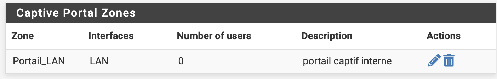

2. Configuration minimale :

   - Description : portail captif interne.
   - Page par défaut du portail laissée telle quelle (page HTML générée par pfSense).
   - Vérification que le DHCP et le DNS fonctionnent sur l’interface LAN.


3. Test depuis la VM Ubuntu :
   - Obtention automatique d’une adresse IP via DHCP et de la passerelle pfSense.
   - Commande de test :  
     `curl -v http://neverssl.com`  
     Résultat : réponse `HTTP/1.1 302 Found` avec un en‑tête `Location` redirigeant vers l’IP de pfSense (ex : `http://192.168.128.2:8002/index.php?zone=portail_lan&redirurl=...`), preuve que le trafic HTTP est intercepté par le portail captif.

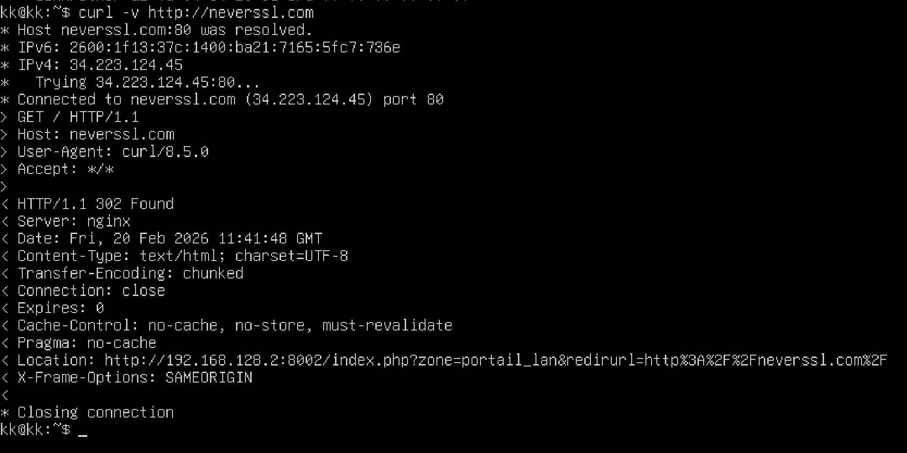

### Questions

- **Dans quels contextes utilise-t-on cela ?**  

  Le portail captif est utilisé sur les réseaux **publics ou invités** : Wi‑Fi d’hôtels, restaurants, gares, aéroports, écoles, entreprises pour visiteurs. Il permet de présenter une page d’accueil (charte, conditions d’utilisation) et éventuellement d’identifier les utilisateurs avant de leur laisser l’accès à Internet.

- **Quelle(s) avantage(s) avec une simple règle de pare-feu ?**  

  Une simple règle de pare-feu ne fait que **autoriser ou bloquer** du trafic réseau, sans interaction avec l’utilisateur. Le portail captif ajoute plusieurs fonctionnalités : affichage d’une **page de bienvenue/charte**, possibilité d’**authentifier ou tracer** les utilisateurs, gestion de **durées de session** ou de tickets, et meilleure conformité légale (on peut prouver qui s’est connecté et quand).

### 17. Sauvegarde / restauration

### Manipulations réalisées

1. **Sauvegarde de la configuration**
   - Accès au menu **Diagnostics → Backup & Restore**.
   - Onglet **Backup**.
   - Sauvegarde complète de la configuration (options par défaut).
   - Clic sur **Download configuration** pour récupérer le fichier `.xml` contenant la configuration pfSense.

2. **Modification de la configuration**

   - Changement volontaire d’un élément de configuration (ex : ajout/suppression d’une règle firewall, etc.).
   - Application des changements et vérification que le comportement de pfSense est bien modifié.

3. **Restauration de la configuration**

   - Retour dans **Diagnostics → Backup & Restore**, onglet **Restore**.
   - Sélection du fichier `.xml` précédemment sauvegardé via **Choose File**.
   - Clic sur **Restore Configuration**.
   - Attente du redémarrage/rechargement de pfSense, puis vérification que la configuration initiale est bien revenue.

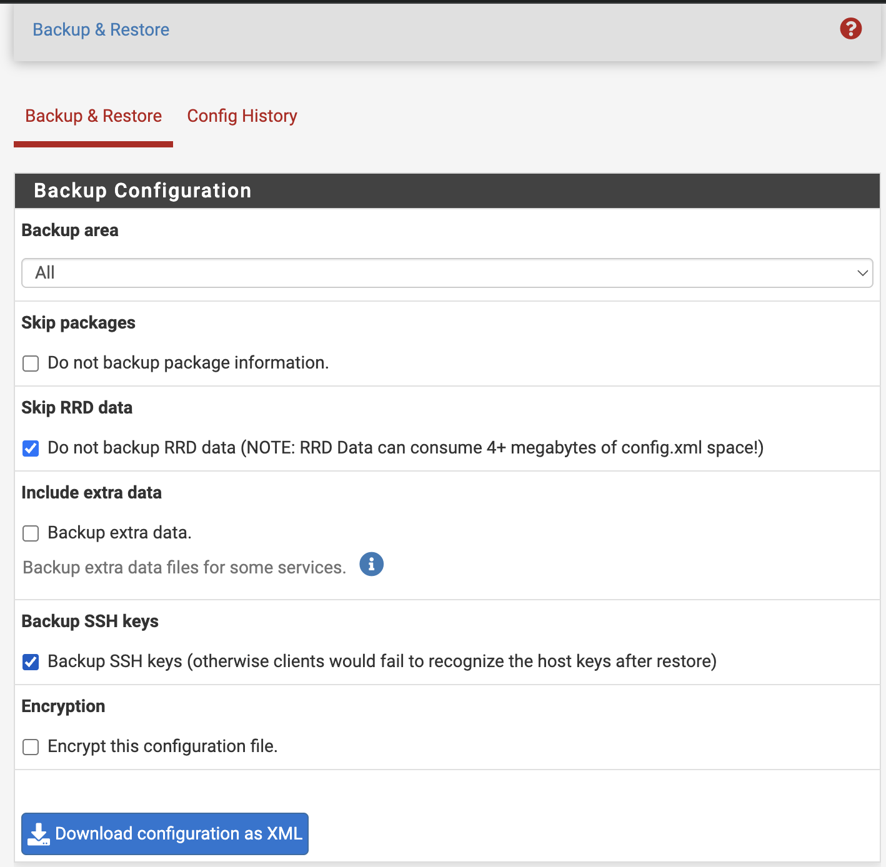

### Question

- **Pourquoi la sauvegarde régulière est-elle essentielle en production ?**  

 En production, si le pare-feu tombe en panne ou est mal configuré, tout le réseau peut être coupé.
Avoir des sauvegardes régulières permet de le remettre vite en état, de réduire la coupure de service et d’éviter de tout reconfigurer à la main sous stress.
