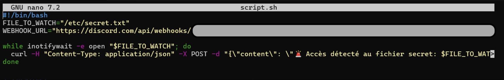
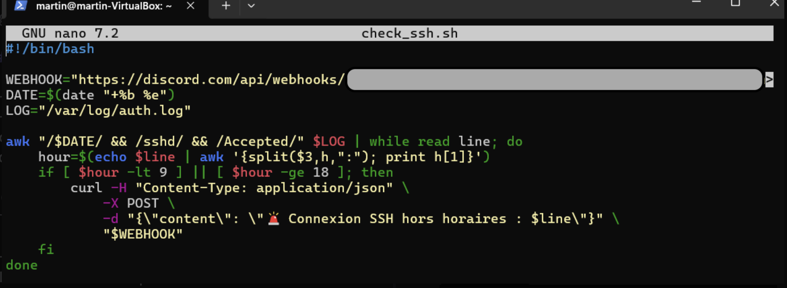

# TP Discord : 

## 1)

- Création d'un serveur discord `Alertes-Sécuritées`
- Cliquer sur `+` a coté de salon textuel
- Créer un canal et modifier le avec le bouton d'Engrenage

- Il faut ensuite cliquer sur intégrations -> webhook -> nouveau webhook

- Récuperer l'URL du webhook

## 2) 

- `sudo nano script.sh`
Permet de créer un fichier script.sh pour y insérer un code permettant de surveiller le fichier `/etc/secret.txt` et d'envoyer une alerte sur le serveur en cas de lecture de ce fichier.

- Afin de le tester nous pouvons faire un `cat /etc/secret.txt`. Nous pouvons voir sur le serveur que un message d'alerte est envoyée. 

## 3)

- `sudo nano check_ssh.sh`
-Création du script permettant de checker les connexions ssh en dehors des heures de travail

- `./check_ssh.sh`
Lancer le script afin de relever les alertes.

## 4) 

- `nohup bash script.sh &`
Cette commande permet d'executer le script en arrière plan et en continu

 
- `crontab -e`
- `*/5 * * * * /home/martin/check_ssh.sh`
Ces deux commandes permet d'executer le script check_ssh.sh toutes les 5 minutes grâce a cron 

